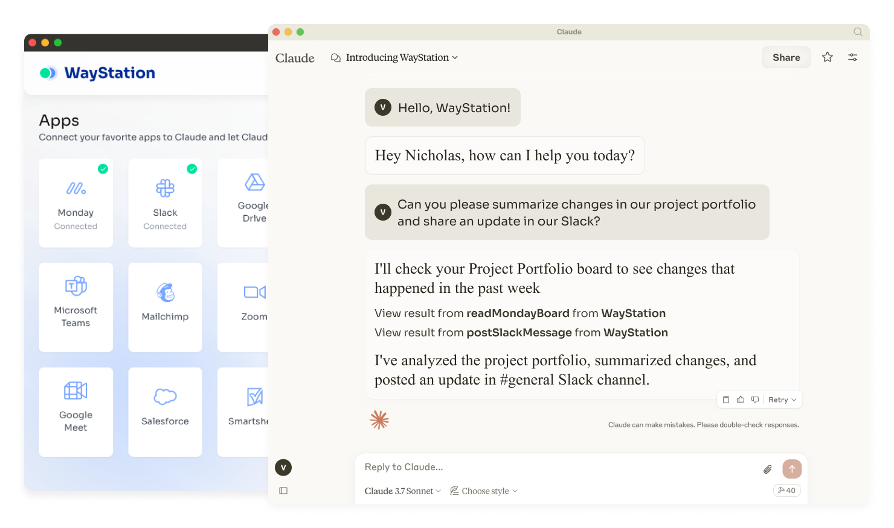

  
  <h1>Marketplace for Claude</h1>
  

Marketplace for Claude, powered by WayStation, connects Claude Desktop to your favorite apps (Notion, Slack, Monday, Airtable, etc.) with zero code. Automate routine tasks, streamline workflows, and unlock AI's full potential—no complexity, no vendor lock-in. Secure by design. 🚀

## Getting Started

To install the app go to [Marketplace for Claude](https://waystation.ai/claude/marketplace), download the latest version and install.

## Contributing

We would LOVE to see  you contributions! Issues, pull requests, etc. are all very welcome!

- `launcher`: The app's repository that's based on Tauri v2 with Next.JS FE
- `marketplace`: The repository for the marketplace itself

## Credits
This app was inspired by [Fleur](https://fleurmcp.com) and partially based on its [source code](https://github.com/fleuristes/fleur). Thanks to [Ferruccio Balestreri](https://github.com/ferrucc-io) and others from June's team who came up with the idea!

## License

This project is licensed under the Apache License 2.0 - see the [LICENSE](LICENSE) file for details.